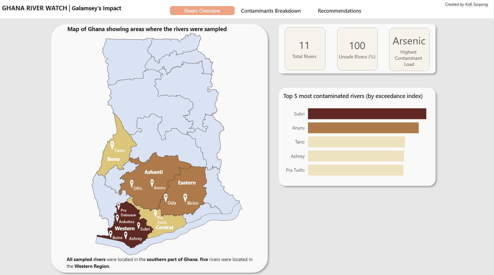
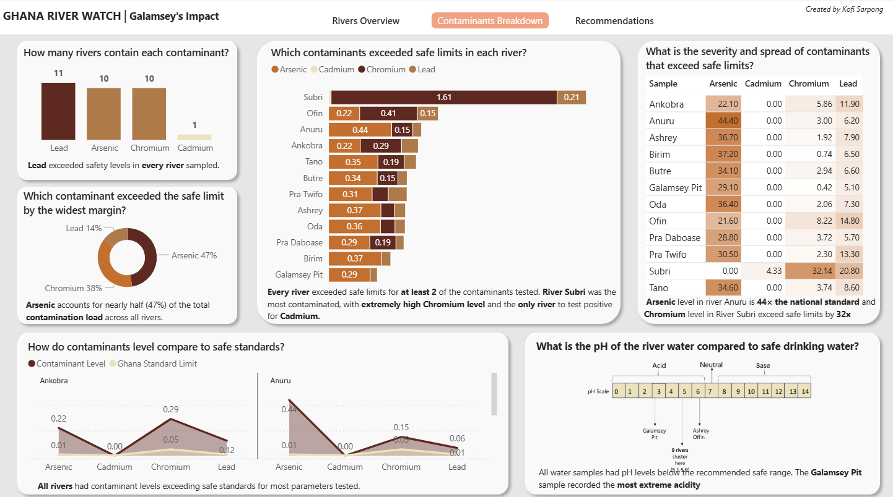
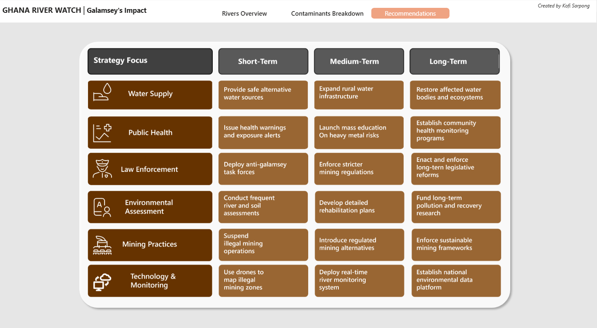

# Ghana's Rivers in Crisis --- Galamsey Pollution Dashboard

> **Power BI \| Environmental & Public Health Analytics \| Ghana**

An interactive Power BI dashboard examining water-quality contamination
across **11 sampled rivers** alongside a separate **Galamsey Pit** sample, 
and compares contaminant levels against the **Ghana Standard**.

------------------------------------------------------------------------

##  Project Overview

This project analyzes available water-quality measurements to identify where sampled
rivers exceed selected safety limits, determine the severity and
distribution of contaminant exceedances, and translate the findings into
potential response strategies.

- **Purpose:** Explore where sampled water exceeds selected standards,
which contaminants contribute to exceedances, and potential response areas.
- **Data:** Open Data Bank Ghana; 11 river samples plus one mining-site sample.
- **Focus parameters:** Arsenic (As), Cadmium (Cd), Chromium (Cr), Lead (Pb), and pH.
- **Tools:** Power BI, DAX, Microsoft Excel.
- **Dashboard pages:** Rivers Overview · Contaminants Breakdown · Recommendations.

------------------------------------------------------------------------

# Dashboard

The dashboard contains **three pages**.

## 1. Rivers Overview

The first page provides the geographic and overall contamination
picture.

### Key question

> **Where is the problem, and what is the overall scale and severity of
> contamination?**

------------------------------------------------------------------------

## 2. Contaminants Breakdown

This page provides a detailed examination of contaminant distribution
and severity.

### Key question

> **What contaminantants are present in each river, and what is the level of
> contamination?**

------------------------------------------------------------------------

## 3. Recommendations

The third page translates the analytical findings into potential
response strategies.

### Key question

> **What can be done about the problem (short, medium and long-term)**

------------------------------------------------------------------------

#  Project Walkthrough

A short walkthrough video demonstrates the dashboard's three pages and
explains the main findings.

**Project walkthrough:**\
[Watch the dashboard walkthrough](https://youtu.be/UVdXCxq_nrg)

------------------------------------------------------------------------

#  Key Findings

- Lead exceeded the analysis benchmark in all 11 sampled rivers.
- Arsenic accounted for 47% of calculated contaminant load, followed by chromium (38%) and lead (14%).
- Every sampled river exceeded limits for at least two assessed contaminants.
- Subri had the highest chromium and lead exceedance ratios and was the only river with a cadmium exceedance.
- All samples had pH below the 6.5–8.5 range; the Galamsey Pit sample had a pH of approximately 3.21.

------------------------------------------------------------------------

#  Public Health Relevance

The dashboard supports **data-driven situational awareness**. 
Water contamination can have implications for population health when
contaminated water is used for drinking, food preparation, household
activities, agriculture, or other forms of human exposure.

------------------------------------------------------------------------

# Important context

These findings describe the available samples and do not establish conditions in every Ghanaian water source, 
prove that mining caused a particular measurement, estimate population exposure, or diagnose health outcomes. 
The Galamsey Pit is a mining-site sample and is not counted among the 11 rivers.

